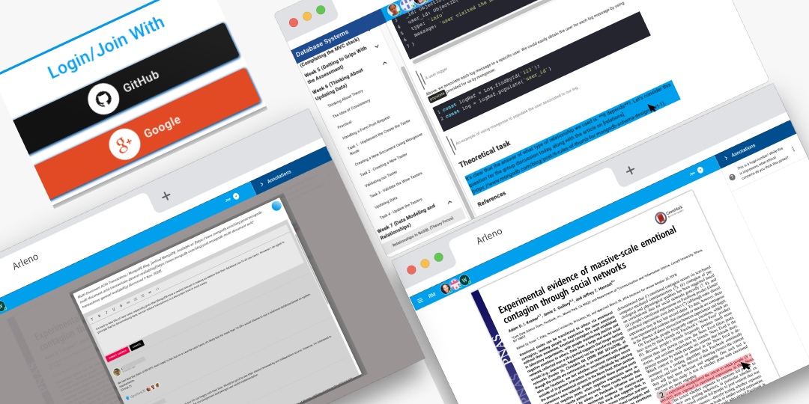

#  Arleno, collaborative reading reimagined

 [Areleno is a tool I created to underpin my PhD](http://www.research.lancs.ac.uk/portal/en/publications/developing-arleno-an-opensource-learning-tool-to-engage-learners-collaboratively-and-critically-in-textbased-learning-materials(1587c14f-f97f-4468-b9b5-2c06c65ef1f6).html). The tool allows a teacher, through social annotation, to turn static text-based content into dynamic inquiry-based activities that can support a critical Community of Inquiry.

## Technologies Used 

- NextJS 
- Firebase 

## Roadmap 

This project is free to use; however, I am refactoring it to make it more accessible to general developers. Currently, I am working on the  TODO list below. Please feel free to fork the project and open a pull request addressing one of the below items:

[ ] Add environment variables to allow more flexibility with Firebase projects
[ ] Migrate from Firebase to Prisma and PostgreSQL.
[ ] Migrate from Material UI to Tailwind 

